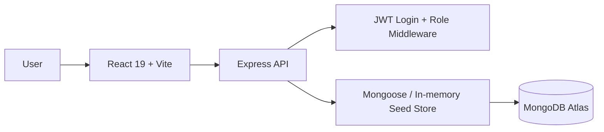

# NITR EvalPortal

Marks Submission Management System (MSMS) for the Department of Computer Science and Engineering, NIT Rourkela.

## What is included

- React 19 + Vite + TypeScript frontend
- Tailwind CSS v4 UI with glassmorphism, dark mode, responsive navigation, skeletons, empty states, and toasts
- Node.js + Express + TypeScript backend
- MongoDB Atlas-ready data layer with Mongoose models
- JWT authentication and role-based route protection
- Seeded demo data for admin, coordinator, and faculty flows
- Dashboard, users, subjects, students, panels, marks, reports, and settings screens
- Spreadsheet export/import path using `xlsx` and `multer`

## Demo credentials

- Admin: `admin@nitr.edu` / `Password123!`
- Coordinator: `coordinator@nitr.edu` / `Password123!`
- Faculty: `faculty@nitr.edu` / `Password123!`

## Quick start

1. Install dependencies:

   ```bash
   pnpm install
   ```

2. Configure environment variables:

   - Copy [.env.example](.env.example) to `.env`
   - Fill in your MongoDB Atlas connection string and JWT secret

3. Run the app:

   ```bash
   pnpm dev
   ```

4. Open the apps:

   - Frontend: `http://localhost:5173`
   - Backend health: `http://localhost:4000/api/health`

## Architecture



## Project structure

- [frontend](frontend) - React dashboard application
- [backend](backend) - Express API and data models
- [docs](docs) - installation, Atlas setup, roadmap, and placeholders

## Backend API

- `POST /api/auth/login`
- `GET /api/users`
- `GET /api/students`
- `GET /api/subjects`
- `GET /api/panels`
- `GET /api/marks`
- `GET /api/dashboard`
- `GET /api/health`

## Seed data

Use the root seed script to refresh the local demo dataset:

```bash
pnpm seed
```

If `MONGODB_URI` is configured, the seed data is also written into MongoDB.

## Notes for future contributors

- The backend is designed to fall back to in-memory demo data when MongoDB is unavailable.
- Keep UI primitives in `frontend/src/components/ui` and page composition in `frontend/src/pages`.
- Extend data contracts through `frontend/src/types/api.ts` and `backend/src/data/store.ts` together.
